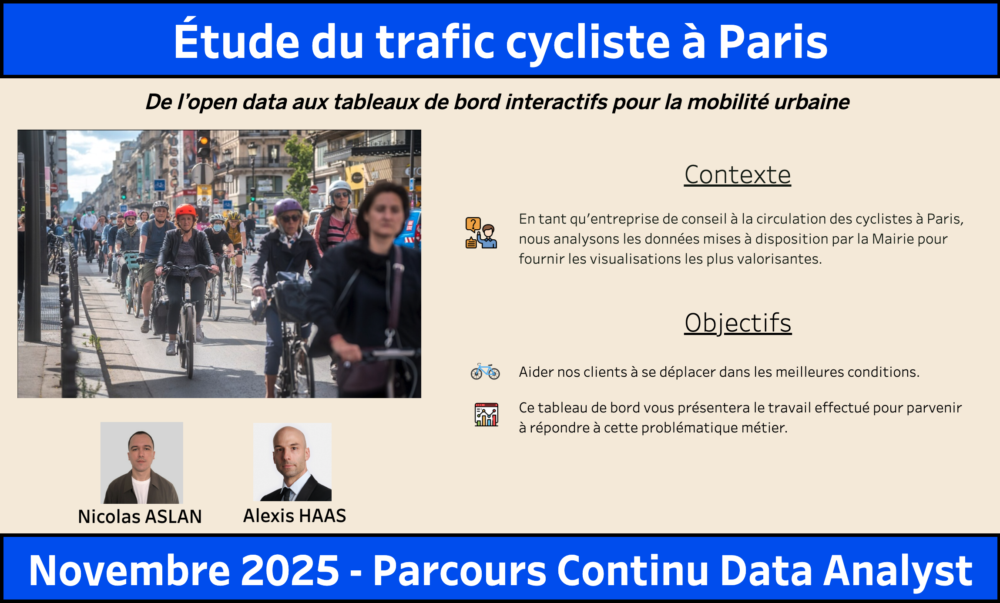
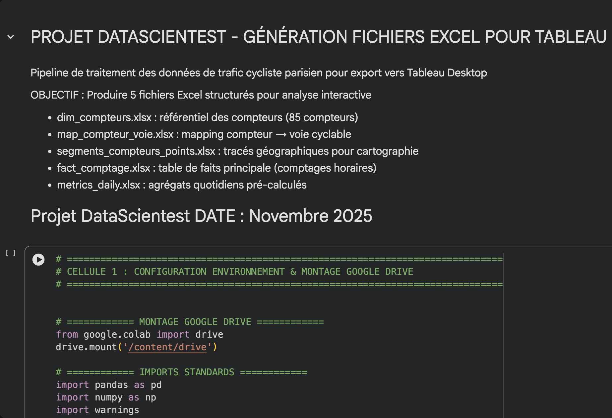

# 👋 Présentation

Vous trouverez sur mon GitHub les différents examens ainsi que le projet fil rouge issus de ma formation Data Analyst (Liora by DataScientest x École des Mines de Paris), réalisée entre avril et décembre 2025. J’aime transformer des données brutes en KPIs, datavisualisations et recommandations concrètes, compréhensibles par des équipes non techniques. Mon parcours mêle analyse et storytelling (issu de mon expérience en journalisme et data sport). 

# 🧩 Mise en situation

Ce repository regroupe des travaux réalisés dans un contexte “proche du réel” :

- Partir d’une problématique métier,

- Nettoyer / structurer les données,

- Analyser et faire émerger les leviers de performance,

- Restituer via un dashboard et une narration claire.

# 🚲 Projet fil rouge — Analyse du trafic cycliste à Paris

## 🎯 Dashboard Tableau

Vous pouvez cliquer sur l'image pour vous rendre sur le tableau de bord et naviguer entre les onglets.

### 📓 Colab Notebook de pipeline de traitement des données pour l'export vers Tableau

# Objectif : guider la prise de décision pour favoriser une meilleure circulation des cyclistes dans la ville. 

Ce projet inclut notamment :

📌 Cadrage : définition d’une problématique et des indicateurs clés

🧹 Préparation : traitement Python d’un fichier Excel d’environ 1 million de lignes

📊 Restitution : KPIs & visualisations + dashboard Tableau

🧭 Vulgarisation : guide de lecture pour un public non technique (comment interpréter et exploiter le dashboard)

# 🧪 Examens & exercices

Les dossiers rassemblent des cas pratiques et évaluations autour de :

- SQL (requêtes, extraction, logique d’analyse)

- Python (Pandas, NumPy)

- Statistiques exploratoires

- Datavisualisations

- Text Mining

# 🛠️ Compétences développées
# 💻 Tech & outils

- Python (Pandas, NumPy, Matplotlib, Seaborn)

- SQL

- Excel avancé

- Tableau

- Jupyter / Colab

# 🔎 Méthode d’analyse

- Nettoyage, exploration, structuration des données

- Construction de KPIs et tableaux de bord

- Restitution orientée décision (insights → recommandations)

# ✍️ Communication

- Synthèse, clarté, vulgarisation

- Storytelling (mise en récit d’un résultat analytique)

# 📌 À propos de mon parcours

Avant cette reconversion, j’ai travaillé comme Data Insights Editor chez Stats Perform (2018–2024), dans l’analyse statistique sportive et la production d’insights “prêts à l’emploi”. Côté formation initiale, je suis diplômé de ESJ Lille (journalisme de sport). 

# 📬 Contact

LinkedIn : linkedin.com/in/nicolasaslan

Email : aslannicolas@gmail.com
